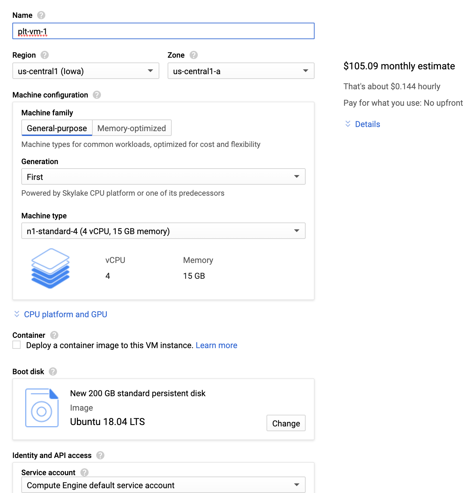

# COMS W4115: Programming Assignment 0 (Environment Setup)

## Course Summary

**Course&nbsp;&nbsp;&nbsp;&nbsp;&nbsp;&nbsp;:** COMS 4115 Programming Languages and Translators (Fall 2020)  
**Website&nbsp;&nbsp;&nbsp;&nbsp;&nbsp;:** https://www.rayb.info/fall2020  
**University&nbsp;:** Columbia University  
**Instructor&nbsp;:** [Prof. Baishakhi Ray](https://www.rayb.info/)

## Logistics
- **Announcement Date:** Wednesday, September 9, 2020
- **Due Date:** Sunday, September 13, 2020 by 11:59 PM. **No extensions!**
- **Total Points:** 5

## Assignment

This assignment will require setting up your environment in preparation for future programming assignments.

### Creating a Virtual Machine

We have allocated Google Cloud (GCloud) credits for each student. Please email your UNI to the instructors/TAs, and you will be sent a $200 GCloud coupon by email.

1. Follow these initial [instructions](http://www.cs.columbia.edu/crf/cloud-cs/) to redeem your course coupon.
2. Create a project for this class, and give it a name (_e.g._, "coms4115"). This will likely have to be created within the _columbia_ organization. 
3. Navigate to *Compute Engine* (while in the context of the new project), and create a virtual machine to match the specification shown below (you may select your own name). The most notable changes are:
	* Leave the region/zone to `us-central1` and `us-central1-a`.
	* Machine type: `n1-standard-4`
	* Click "change'' under boot disk to select `Ubuntu 18.04 LTS`, and add at least 120 GB of persistent hard disk (HDD).
	* Leave the defaults for the remaining options: `Compute Engine Default Service Account`, `Allow default access`, and `Unchecked boxes for Allow HTTP/HTTPS traffic`.
4. Upon creation of the VM, SSH into the machine by clicking the SSH button next to the instance in Compute Engine, or add your SSH keys to log in using your own terminal. More information on access can be found [here](https://cloud.google.com/compute/docs/instances/connecting-to-instance).

  

**IMPORTANT:** You must _shut down_ your instance when not in use. There are not enough credits to keep the server running continuously. Ensure it is shut down when not in use so that you do not lose credits unintentionally. There should be enough credits for about 850 hours of compute time.

Note that the GCloud VMs will have the same Ubuntu base image, and you can install necessary libraries on top of LLVM Clang (see the subsection titled, "Building LLVM/Clang"). However, you may choose to use other open-source software to create your VMs. If you do so, please follow these steps:

* Create Ubuntu 18.04.3 Virtual Machine by using either VMware Workstation 15 Player or Oracle VM VirtualBox to install Ubuntu 18.04.3.
    - At least 8 GB memory is required for the virtual machine, and 12 GB memory is recommended.
    - At least 120 GB hard disk is required.
* Install the necessary packages (which can also be installed by running the `setup.sh` shell script we provide):
    - `sudo apt update`
    - `sudo apt upgrade`
    - `sudo apt install build-essential subversion cmake python3-dev`
    - `sudo apt install libncurses5-dev libxml2-dev libedit-dev swig`
    - `sudo apt install doxygen graphviz xz-utils git`

### Installing Git

Version control with Git will be a large aspect of this course. You will be managing and submitting your programming assignments using Git. Since assignments are completed in the Linux environment, you will be able to access Git directly from the Linux shell.

Please follow these instructions for installing Git:

1.  Make sure you have Git installed. Instructions on installing Git for Linux can be found [here](https://git-scm.com/book/en/v2/Getting-Started-Installing-Git).
2.  To improve your Git experience, you will need to set up SSH keys for the machine using Git, if you haven't done so. To set up SSH keys, please refer to this [page](https://docs.github.com/en/enterprise/2.20/user/github/authenticating-to-github/generating-a-new-ssh-key-and-adding-it-to-the-ssh-agent). Note that you only need to complete the subsection titled _Generating a new SSH key_ for Linux.
3.  Add your newly-generated SSH keys to the GitHub account, as done [here](https://docs.github.com/en/enterprise/2.20/user/github/authenticating-to-github/adding-a-new-ssh-key-to-your-github-account).

### Creating a GitHub Account

If you do not already have a GitHub account, please create an account in [GitHub](http://www.github.com/). Remember to submit all future assignments using this GitHub username.

### Setting Up GitHub Classroom

Throughout the semester, we will be using [GitHub Classroom](https://classroom.github.com/) for programming assignment submissions. Please follow these steps to set up GitHub Classroom:
* For each assignment, you will receive a GitHub classroom invitation through Gradescope/Courseworks.
* Log in to GitHub with your UNI username, and accept the invitation. Once you accept the invitation, the repository will be created for you, and you will then have write access.

## Submission
Please add your Columbia UNI and GitHub username in the [uni.txt](uni.txt) file we have created, and make sure to commit and push this file in your final submission.

## Piazza

If you have any questions about this programming assignment, please post them in the [Piazza forum](https://piazza.com/class/kekhb0ii3uh23z?cid=7) for the course, and an instructor will reply to them as soon as possible. Any updates to the assignment itself will be available in Piazza.

## Disclaimer

This assignment belongs to Columbia University. It may be freely used for educational purposes.
